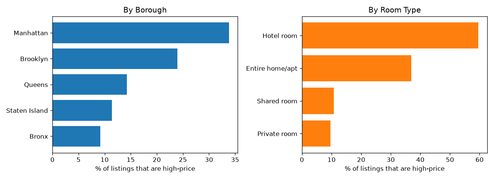
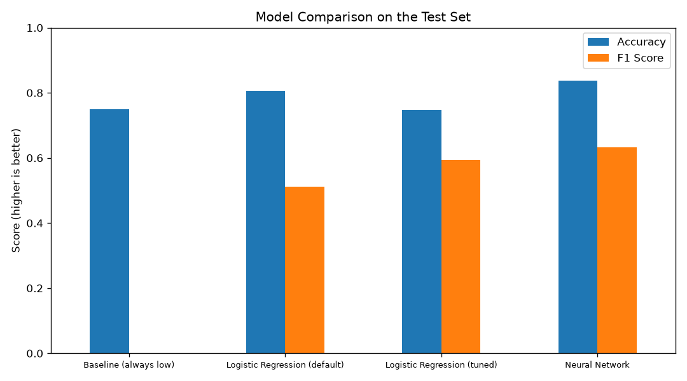

# 🏙️ Airbnb NYC Price Prediction

A machine-learning project that predicts whether a New York City Airbnb listing is **high-priced** or **low-priced**, and shows which factors drive a listing's price.

**Best result:** a neural network reached **83.8% accuracy and an F1 score of 0.63** on unseen listings, compared with a 74.9% baseline that finds no high-price listings at all.

👉 **[Open the notebook](airbnb_price_prediction.ipynb)** to see all the code, charts and results step by step.

---

## 📌 Overview

Airbnb hosts often don't know whether their listing is priced correctly. This project looks at a listing's features, such as location, room type, size and reviews, and predicts whether it belongs in the **high-price** or **low-price** group.

The goal is to help hosts:
- Price their rentals competitively
- Spot listings that look priced too high or too low
- Understand what raises a listing's value the most

**Dataset:** public New York City Airbnb listings from 2024 (originally from [Inside Airbnb](https://insideairbnb.com/)): 20,758 listings with 22 columns each.
**Type of problem:** Binary classification (high price vs. low price).

> I first built a version of this project as my Break Through Tech AI/ML capstone, using a dataset the program provided. I then rebuilt it on my own with a newer, messier public 2024 dataset. That meant writing new cleaning code, creating the label myself, adding a baseline, tuning for class imbalance, and improving the neural network with dropout and early stopping.

---

## 🛠️ Tools & Technologies

| Category | Tools Used |
|---|---|
| **Language** | Python |
| **Data handling** | pandas, NumPy |
| **Visualization** | Matplotlib, Seaborn |
| **Machine learning** | scikit-learn (Logistic Regression, GridSearchCV) |
| **Deep learning** | TensorFlow / Keras (Neural Network) |
| **Environment** | Jupyter Notebook |

---

## ❓ The Problem

- **What I predict:** Whether a listing is **high price (1)** or **low price (0)**.
- **How "high price" is defined:** The dataset only has the raw nightly price, so I created the label myself. A listing is **high** if its price is at or above the **75th percentile ($198/night)**, meaning the top 25% most expensive listings. Everything else is **low**.
- **Why it matters:** A reliable price-tier predictor helps hosts set competitive prices and shows what drives a listing's value.

---

## 🧹 Steps 1–3: Load, Clean and Label the Data

The raw data needed work before any model could use it:

| Problem in the raw data | What I did |
|---|---|
| `rating` stored as text, with `"No rating"` for new listings | Converted to a number, added a `has_rating` 0/1 flag, filled the blanks with the median |
| `bedrooms` stored as text, with `"Studio"` | Treated a studio as **0 bedrooms** |
| `baths` had `"Not specified"` | Converted to a number and filled the blanks with the median |
| `license` had thousands of different license numbers | Turned it into a simple `has_license` 0/1 flag |
| `last_review` was a date | Turned it into `days_since_last_review`, a rough measure of how active a listing is |
| Extreme prices (for example $100,000/night) | Removed the top 1% of prices (above $999) and any $0 listings |

After cleaning, **20,560 listings** remained. I then created the `high_price` label using the $198 cutoff.

---

## 🔎 Step 4: Exploring the Data

**Key findings:**
- The label is **imbalanced**: about **75% low-price** (15,400) and **25% high-price** (5,160) listings.
- **Location matters a lot.** 34% of Manhattan listings are high-price, compared with 24% in Brooklyn, 14% in Queens, 11% in Staten Island and 9% in the Bronx.
- **Room type matters.** 60% of hotel rooms and 37% of entire homes/apartments are high-price, compared with only 10% of private rooms.
- High-price listings tend to have **more bedrooms**.

**Step 4a: Class Distribution**


**Step 4b: Bedrooms by Price Category**


**Step 4c: High-Price Share by Borough and Room Type**



---

## 🧰 Step 5: Preparing the Data for the Models

- **Removed** ID and free-text columns (`id`, `name`, `host_id`, `host_name`) that don't help the model generalize.
- **Removed** `neighbourhood` (200+ small areas) and kept the **borough** plus **latitude/longitude** for location.
- **Removed the raw `price` column** to avoid **data leakage**. The label was created from price, so keeping it would let the model cheat.
- **One-hot encoded** `room_type` and borough into 0/1 columns, for **24 features** in total.
- **Split** the data 80% training (16,448 rows) / 20% testing (4,112 rows), keeping the same high/low ratio in both parts.
- **Scaled** the features so that columns with big numbers don't outweigh the others. The scaler learned only from the training data.

---

## 🤖 Steps 6–8: Building the Models

### Step 6: Baseline (always guess "low")
Because 75% of listings are low-price, a "model" that always answers "low" is already 75% accurate but never finds a single high-price listing. Any real model has to beat this.

### Step 7: Logistic Regression (traditional machine learning)
- Simple, fast and easy to explain.
- Tuned with **GridSearchCV** (5-fold cross-validation, scored on F1) over:
  - `C`: how strict the model is
  - `class_weight`: whether to give the smaller high-price group extra weight
- Best settings: `C = 10`, `class_weight = "balanced"`.
- Its coefficients show *why* a listing is predicted high or low.

**Step 7c: What Drives a High Price (Logistic Regression coefficients)**


### Step 8: Neural Network (deep learning, TensorFlow/Keras)
- 2 hidden layers (64 and 32 units, ReLU) plus **Dropout (20%)** to reduce overfitting.
- **Adam** optimizer with **early stopping**. Training stops when the validation loss stops improving and keeps the best version of the model.

**Step 8b: Neural Network Training Curves**


---

## 📊 Step 9: Results

All models were tested on the same 20% of listings that they never saw during training:

| Model | Accuracy | F1 Score |
|---|---|---|
| Baseline (always "low") | 74.9% | 0.000 |
| Logistic Regression (default) | 80.7% | 0.512 |
| Logistic Regression (tuned) | 74.7% | 0.594 |
| **Neural Network** | **83.8%** | **0.632** |



**What this means:**
- **Accuracy** is how often the model was right overall. On its own it can mislead here, because the baseline already gets 75%.
- **F1 score** measures how well the model finds the harder, smaller high-price group, so it is the more important number for this problem.
- **Tuning Logistic Regression with balanced class weights raised F1 from 0.51 to 0.59.** It now catches many more high-price listings, but it also raises more false alarms, which is why its accuracy fell. That's a real trade-off, not a free improvement.
- The **neural network was best on both metrics.** It can learn patterns that a straight-line model can't, such as the way latitude and longitude combine to mark expensive areas.

---

## 💡 Key Takeaways

- **More bedrooms, beds and baths**, **entire-home listings**, **Manhattan location** and **higher ratings** push a listing toward the high-price group.
- **Private rooms**, **Staten Island/Brooklyn locations** and **long minimum stays** push toward the low-price group.
- **Recommendation:** Use the **neural network** when accuracy matters most. Use **Logistic Regression** when hosts need a clear explanation of *why* their listing is priced the way it is, because it trains almost instantly and its coefficients are easy to read.

---

## ⚖️ Ethical Considerations

- Neighborhood and location data can act as a stand-in for race or income, because NYC neighborhoods are often divided along those lines. The model could therefore learn location-based bias.
- Hosts in lower-income boroughs are most at risk. If their listings keep being labeled "low price," they may underprice and earn less.
- Any real deployment should be checked for fairness across boroughs before use.

---

## 🚀 What I'd Do Next

- Extract more features from the listing `name` text (for example "luxury" or "loft").
- Group the 200+ small `neighbourhood` values into useful clusters instead of dropping them.
- Try tree-based models (Random Forest, Gradient Boosting), which often do well on this kind of table data.
- Predict the **actual price** (regression) instead of only high or low.

---

## 📁 Project Files

| File | Description |
|---|---|
| `airbnb_price_prediction.ipynb` | **Main file.** Jupyter notebook with every step, chart and result |
| `airbnb_price_prediction.py` | The same code as a plain Python script, to run everything at once |
| `Airbnb/new_york_listings_2024.csv` | The NYC Airbnb 2024 dataset |
| `screenshots/` | Charts used in this README (saved automatically when the code runs) |
| `requirements.txt` | Python libraries needed |

---

## ▶️ How to Run

1. Install the required libraries:
   ```
   pip install -r requirements.txt
   ```
2. **Option A: step by step (recommended).** Open `airbnb_price_prediction.ipynb` in VS Code or Jupyter and run the cells from top to bottom.
3. **Option B: all at once.**
   ```
   python airbnb_price_prediction.py
   ```
   Results print in the terminal and the charts are saved in the `screenshots/` folder.
