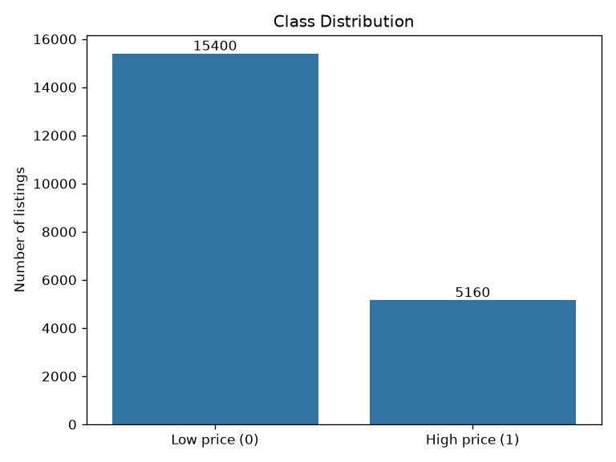
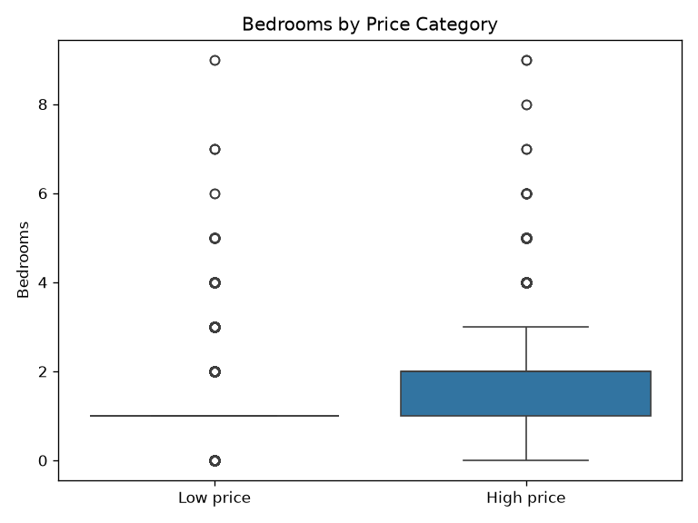
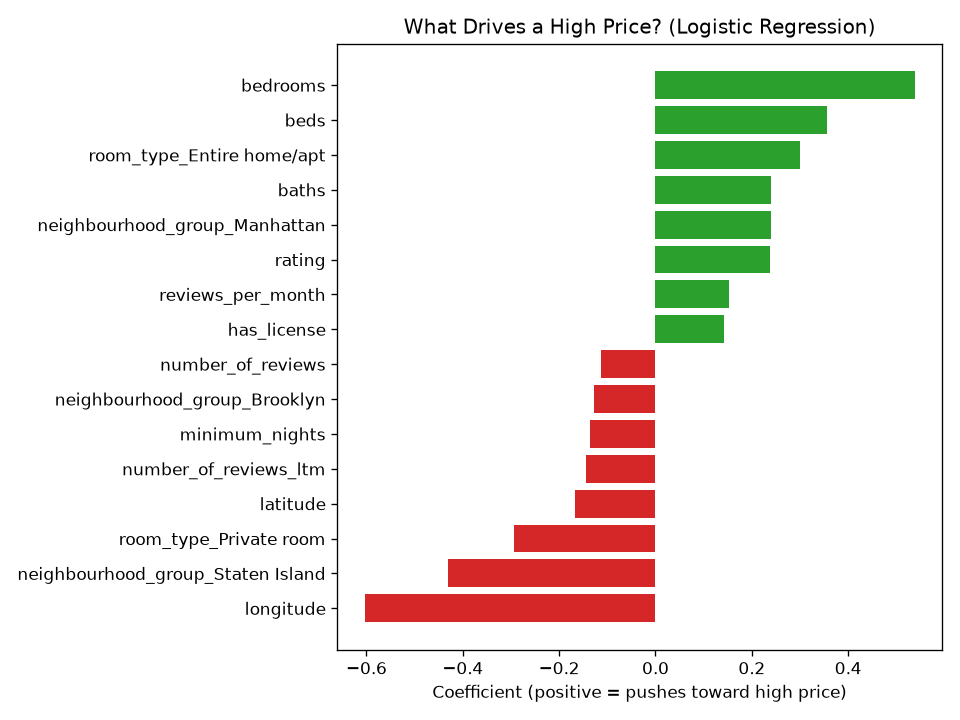
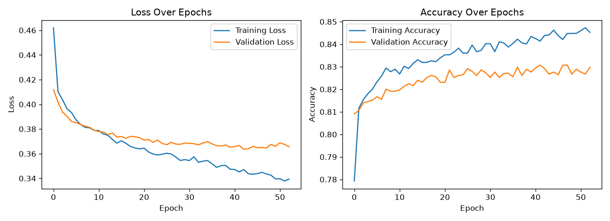

# 🏙️ Airbnb NYC Price Prediction — Machine Learning Capstone

A machine-learning project that predicts whether a New York City Airbnb listing is **high-priced** or **low-priced**, and uncovers the key factors that drive a listing's price.

---

## 📌 Overview

Airbnb hosts often struggle to know if their listing is priced correctly. This project builds a tool that looks at a listing's features — like location, room type, and size — and predicts whether it falls into the **high-price** or **low-price** group.

The goal is to help hosts:
- Price their rentals competitively
- Spot listings that are priced too high or too low
- Understand what most increases a listing's value

**Dataset:** 28,000+ Airbnb listings in New York City, with 51 attributes per listing.
**Type of problem:** Binary classification (high price vs. low price).

---

## 🛠️ Tools & Technologies

| Category | Tools Used |
|---|---|
| **Language** | Python |
| **Data handling** | pandas, NumPy |
| **Visualization** | Matplotlib, Seaborn |
| **Machine learning** | scikit-learn (Logistic Regression, GridSearchCV) |
| **Deep learning** | TensorFlow / Keras (Neural Network) |

---

## ❓ The Problem

- **What we predict:** Whether a listing is `high` price or `low` price.
- **How "high price" is defined:** A listing is labeled **high** if its price is at or above the 75th percentile (the top 25% most expensive listings); otherwise it is **low**.
- **Why it matters:** A reliable price-tier predictor helps hosts set competitive prices and helps a rental company advise its clients on what drives listing value.

---

## 🔎 Step 1: Exploring the Data

Before building any model, I explored the data to understand its shape and quality.

**Key findings:**
- The dataset had **28,022 listings** and **51 columns**.
- The label was **mildly imbalanced** — about **75% low-price** and **25% high-price** listings.
- Some columns (`host_response_rate`, `host_acceptance_rate`) were missing for ~40% of listings, so they were removed.
- A few columns had extreme outliers (e.g., one host had 3,387 listings).
- High-price listings tended to have **more bedrooms** than low-price listings.

**📷 Screenshot — Class Distribution (high vs. low price):**

<!-- Paste your class distribution bar chart screenshot below -->


**📷 Screenshot — Bedrooms by Price Category (box plot):**

<!-- Paste your bedrooms box plot screenshot below -->


---

## 🧹 Step 2: Preparing the Data

To get the data ready for modeling, I:
- Converted the price label into numbers (**high = 1, low = 0**).
- **Removed** free-text and ID columns (like `name` and `host_about`) that don't help prediction.
- **Removed** columns with too many missing values (~40% missing).
- **Removed the raw price column** to avoid "data leakage" — since the label was created from price, keeping it would let the model cheat.
- **Filled in** the few remaining missing values (`bedrooms`, `beds`) with the median.
- **One-hot encoded** categories like `room_type` and neighborhood into numeric columns.
- **Scaled** the features so no single column dominates just because its numbers are larger.

---

## 🤖 Step 3: Building the Models

I trained and compared **two different approaches** to the same problem:

### Model 1 — Logistic Regression (traditional machine learning)
- Simple, fast, and easy to explain.
- Tuned using **GridSearchCV** to find the best settings.
- Its coefficients clearly show *why* a listing is priced high or low.

### Model 2 — Neural Network (deep learning, TensorFlow/Keras)
- 2 hidden layers (64 and 32 units), trained for 100 epochs.
- More complex, but better at catching the smaller "high-price" group.

**📷 Screenshot — Model Coefficients (what drives price):**

<!-- Paste your Logistic Regression coefficients screenshot below -->


**📷 Screenshot — Neural Network Training Curves (Loss & Accuracy over epochs):**

<!-- Paste your training/validation loss and accuracy plots below -->


---

## 📊 Step 4: Results

Both models were tested on unseen data. Here's how they compared:

| Metric | Logistic Regression | Neural Network |
|---|---|---|
| **Accuracy** | 82.1% | **84.8%** |
| **F1 Score** | 0.594 | **0.658** |

**📷 Screenshot — Results Comparison Table:**

<!-- Paste your side-by-side results table screenshot below -->


**What this means:**
- The **neural network performed slightly better** on both measures.
- **Accuracy** = how often the model was right overall (~85%).
- **F1 score** = a balanced measure of how well the model catches the harder-to-predict high-price listings.

---

## 💡 Step 5: Key Takeaways

- Features like **more bedrooms**, **higher guest capacity**, **entire-home listings**, and **Manhattan location** pushed listings toward the **high-price** group.
- The **neural network** was the stronger performer, but only by a modest margin.
- **Recommendation:** For real-world use, I would recommend **Logistic Regression** for this client — it was nearly as accurate, trains almost instantly, and its results are easy to explain to hosts. If catching every high-price listing were critical, the neural network would be the better choice.

---

## ⚖️ Ethical Considerations

- Neighborhood data can act as a stand-in for race or income, since NYC neighborhoods are often divided along those lines — so the model could unintentionally learn location-based bias.
- Hosts in lower-income neighborhoods are most at risk: if their listings are repeatedly predicted as "low price," they may underprice and earn less.
- Any real deployment should be checked for fairness across neighborhoods before use.

---

## 🚀 What I'd Do Next

- Address the class imbalance using **class weights** or **resampling** to improve the F1 score.
- Further tune the neural network (different layers, units, and learning rates).
- Test additional features and preprocessing steps.

---

## 📁 Project Files

| File | Description |
|---|---|
| `Capstone.ipynb` | Full Jupyter notebook with code, charts, and written analysis |
| `capstone.py` | Clean, code-only Python version of the project |
| `data_capstone/airbnbListingsData.csv` | The Airbnb NYC listings dataset |
| `README.md` | This file |

---

## ▶️ How to Run

1. Make sure the dataset is in the `data_capstone` folder.
2. Install the required libraries:
   ```
   pip install pandas numpy matplotlib seaborn scikit-learn tensorflow
   ```
3. Run the notebook (`Capstone.ipynb`) or the script:
   ```
   python capstone.py
   ```

---

*This project was completed as part of the Break Through Tech Machine Learning program.*
